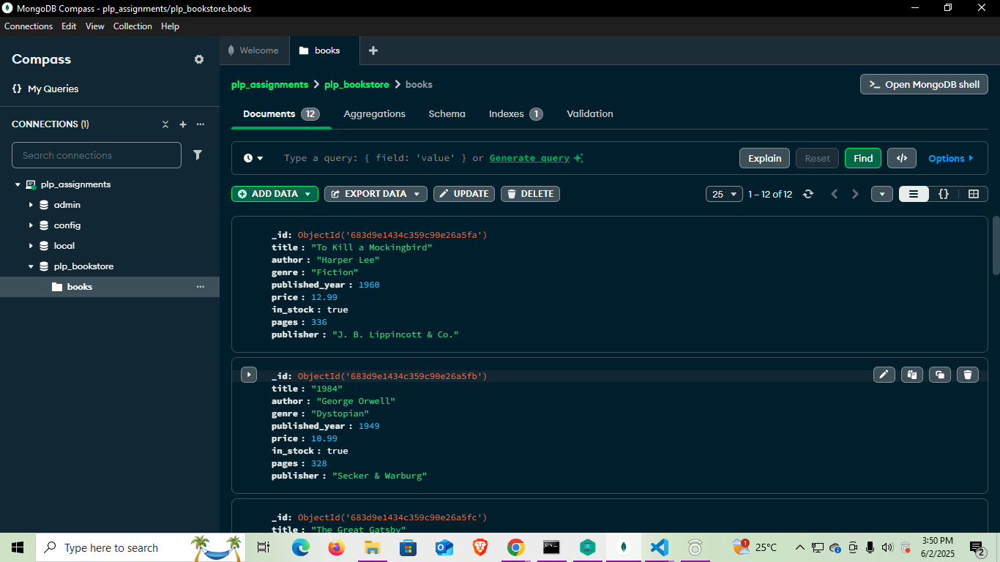

# Week 1 MongoDB Fundamentals Assignment

## Overview
This assignment focuses on understanding the fundamentals of MongoDB, including database creation, CRUD operations, and querying data. The goal is to build a solid foundation for working with MongoDB in real-world applications.

## Prerequisites
- MongoDB installed on your system. [Download MongoDB](https://www.mongodb.com/try/download/community)
- Basic knowledge of JavaScript and JSON.
- A code editor (e.g., VS Code).

## Setup Instructions
1. Clone this repository to your local machine:
   ```bash
   git clone  https://github.com/PLP-MERN-Stack-Development/week-1-mongodb-fundamentals-assignment-Miss-Maggie.git
   ```
2. Navigate to the project directory:
   ```bash
   cd week-1-mongodb-fundamentals-assignment-Miss-Maggie
   ```
3. Start your MongoDB server:
   ```bash
   mongod
   ```
4. Open the MongoDB shell:
   ```bash
   mongo
   ```

## Assignment Tasks
1. **Database Creation**:
   - Create a new database named `plp_bookstore`.
   - Add a collection named  `books`

2. **CRUD Operations**:
   - Insert sample data into the collection.
   - Perform update, delete, and read operations on the data.

3. **Querying Data**:
   - Write queries to filter, sort, and aggregate data.

## Submission
- Ensure all tasks are completed and documented.
- Submit your completed assignment by pushing your changes to the repository and sharing the link.

## Resources
- [MongoDB Documentation](https://www.mongodb.com/docs/)
- [MongoDB University](https://university.mongodb.com/)

## License
This project is licensed under the MIT License.

## Author

`Miss-Maggie`

## Screenshot

`![Screenshot]`
